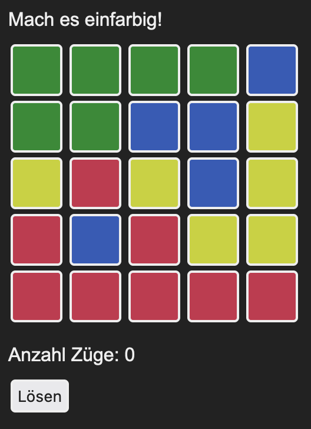

# Lights out

Dies ist eine (programmier)technisch modernisierte Fassung des [Lights-out-Spiels anlässlich der 600. Ausgabe der c’t](https://www.heise.de/ct/600/).

## Lizenz

Siehe [LICENSE](LICENSE)

## Copyright

Copyright ©️ 2023 [Oliver Lau](mailto:ola@ct.de), [Heise Medien GmbH & Co. KG](https://www.heise-gruppe.de/artikel/Heise-Medien-3904998.html)

## Nutzungshinweise

Diese Software wurde zu Lehr- und Demonstrationszwecken geschaffen und ist nicht für den produktiven Einsatz vorgesehen. Heise Medien und der Autor haften daher nicht für Schäden, die aus der Nutzung der Software entstehen, und übernehmen keine Gewähr für ihre Vollständigkeit, Fehlerfreiheit und Eignung für einen bestimmten Zweck.